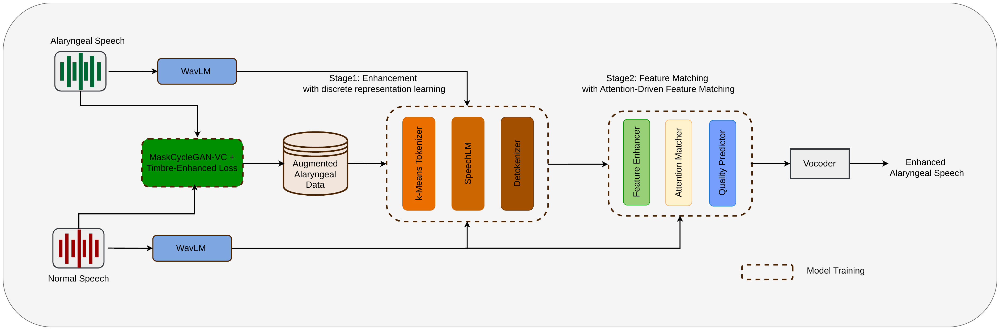

# Attention-Driven-Alaryngeal-Speech-Enhancement
This repository contains the source code for training and inferencing of our work titled "Attention-Driven Alaryngeal Speech Enhancement via Discrete Representation Learning and Timbre-Preserving Augmentation". In compliance with ethical guidelines and to protect patient privacy, the speech datasets used in this work are not publicly releaseed.

## Overall Pipeline

## Links
Paper : 

Demo Page :  https://kris1719.github.io/ADASE/

Pretrained-model : Please access to the releases

## Training Configurations

## Inference Configurations

## Reference

SELM : https://doi.org/10.48550/arXiv.2312.09747

kNN-VC : https://doi.org/10.48550/arXiv.2305.18975

